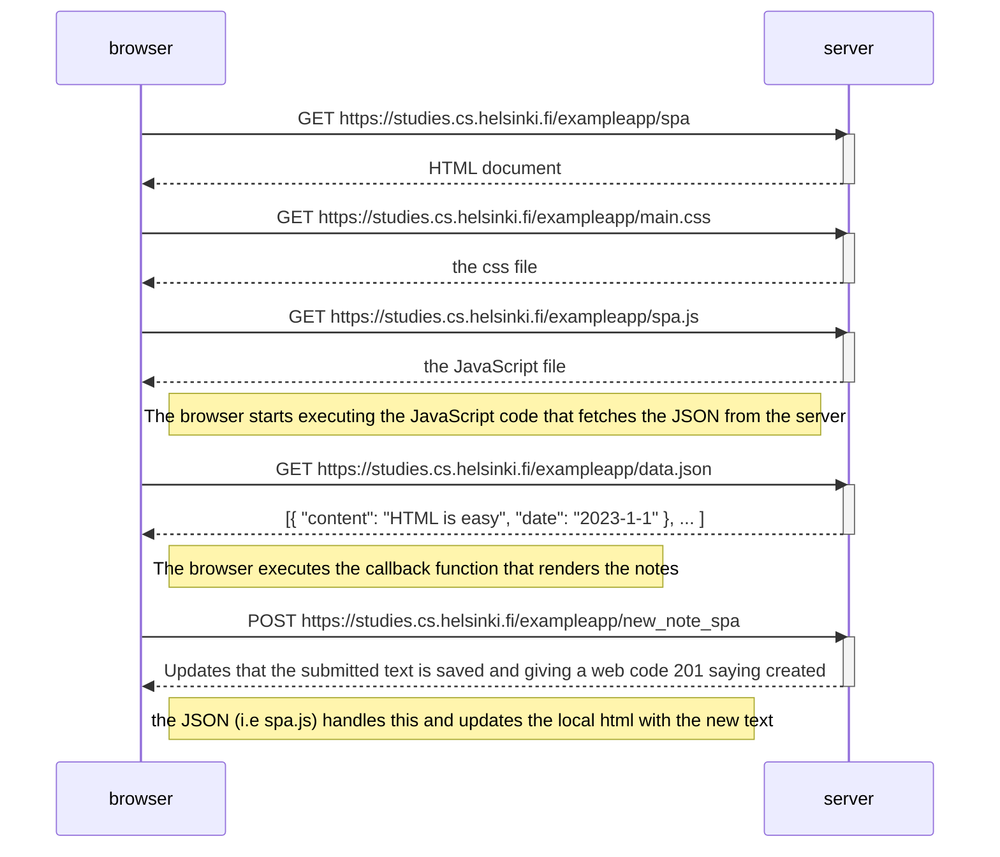

# Web Request Sequence when adding new note to notes website

### Question:
The situation where the user goes to the single-page app version of the notes app at https://studies.cs.helsinki.fi/exampleapp/spa.
Create a diagram depicting the situation where the user creates a new note using the single-page version of the app.

### Answer

